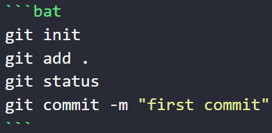

# 实验二 Python变量、简单数据类型

班级： 21计科1班

学号： B20210302131

姓名： 李佳琪

Github地址：https://github.com/Seven116

CodeWars地址：https://www.codewars.com/users/Seven116

---

## 实验目的

1. 使用VSCode编写和运行Python程序
2. 学习Python变量和简单数据类型

## 实验环境

1. Git
2. Python 3.10
3. VSCode
4. VSCode插件

## 实验内容和步骤

### 第一部分

实验环境的安装

1. 安装Python，从Python官网下载Python 3.10安装包，下载后直接点击可以安装：[Python官网地址](https://www.python.org/downloads/)
2. 为了在VSCode集成环境下编写和运行Python程序，安装下列VScode插件
   - Python
   - Python Environment Manager
   - Python Indent
   - Python Extended
   - Python Docstring Generator
   - Jupyter
   - indent-rainbow
   - Jinja

---

### 第二部分

Python变量、简单数据类型和列表简介

完成教材《Python编程从入门到实践》下列章节的练习：

- 第2章 变量和简单数据类型

---

### 第三部分

在[Codewars网站](https://www.codewars.com)注册账号，完成下列Kata挑战：

---

#### 第1题：求离整数n最近的平方数（Find Nearest square number）

难度：8kyu

你的任务是找到一个正整数n的最近的平方数
例如，如果n=111，那么nearest_sq(n)（nearestSq(n)）等于121，因为111比100（10的平方）更接近121（11的平方）。
如果n已经是完全平方（例如n=144，n=81，等等），你需要直接返回n。
代码提交地址
<https://www.codewars.com/kata/5a805d8cafa10f8b930005ba>

---

#### 第2题：弹跳的球（Bouncing Balls）

难度：6kyu

一个孩子在一栋高楼的第N层玩球。这层楼离地面的高度h是已知的。他把球从窗口扔出去。球弹了起来,  例如:弹到其高度的三分之二（弹力为0.66）。他的母亲从离地面w米的窗户向外看,母亲会看到球在她的窗前经过多少次（包括球下落和反弹的时候）？

一个有效的实验必须满足三个条件：

- 参数 "h"（米）必须大于0
- 参数 "bounce "必须大于0且小于1
- 参数 “window "必须小于h。

如果以上三个条件都满足，返回一个正整数，否则返回-1。
**注意:只有当反弹球的高度严格大于窗口参数时，才能看到球。**
代码提交地址
<https://www.codewars.com/kata/5544c7a5cb454edb3c000047/train/python>

---

#### 第3题： 元音统计(Vowel Count)

难度： 7kyu

返回给定字符串中元音的数量（计数）。对于这个Kata，我们将考虑a、e、i、o、u作为元音（但不包括y）。输入的字符串将只由小写字母和/或空格组成。

代码提交地址：
<https://www.codewars.com/kata/54ff3102c1bad923760001f3>

---

#### 第4题：偶数或者奇数（Even or Odd）

难度：8kyu

创建一个函数接收一个整数作为参数，当整数为偶数时返回”Even”当整数位奇数时返回”Odd”。
代码提交地址：
<https://www.codewars.com/kata/53da3dbb4a5168369a0000fe>

### 第四部分

使用Mermaid绘制程序流程图

安装Mermaid的VSCode插件：

- Markdown Preview Mermaid Support
- Mermaid Markdown Syntax Highlighting

使用Markdown语法绘制你的程序绘制程序流程图（至少一个），Markdown代码如下：


显示效果如下：


查看Mermaid流程图语法-->[点击这里](https://mermaid.js.org/syntax/flowchart.html)

使用Markdown编辑器（例如VScode）编写本次实验的实验报告，包括[实验过程与结果](#实验过程与结果)、[实验考查](#实验考查)和[实验总结](#实验总结)，并将其导出为 **PDF格式** 来提交。

## 实验过程与结果

请将实验过程与结果放在这里，包括：

- [第二部分 Python变量、简单数据类型和列表简介](#第二部分)
- [第三部分 Codewars Kata挑战](#第三部分)
  
  #### 第1题：求离整数n最近的平方数（Find Nearest square number）

  ```python
  import math
  def nearest_sq(n):
    n=n**0.5
    n=round(n)
    n=n**2
    return n
    ```

   #### 第2题：弹跳的球（Bouncing Balls）

    ```python
   def bouncing_ball(h, bounce, window):
    res = -1
    if(bounce > 0 and bounce < 1):
       while(h > 0 and window < h):
        res +=2
        h *=bounce        
    return res
    ```

   #### 第3题： 元音统计(Vowel Count)

  ```python
  def get_count(input_str):
    num_vowels = 0
    h=['a','e','i','o','u']
    for i in h:
        num_vowels+=input_str.count(i)
    return num_vowels
    ```

   #### 第4题：偶数或者奇数（Even or Odd）

  ```python
  def even_or_odd(number):
  return 'Even' if number % 2 == 0 else 'Odd'
  ```

- [第四部分 使用Mermaid绘制程序流程图](#第四部分)
  #### 第4题：偶数或者奇数（Even or Odd）


注意代码需要使用markdown的代码块格式化，例如Git命令行语句应该使用下面的格式：

显示效果如下：

```bash
git init
git add .
git status
git commit -m "first commit"
```

如果是Python代码，应该使用下面代码块格式
显示效果如下：


```python
def add_binary(a,b):
    return bin(a+b)[2:]
```

代码运行结果的文本可以直接粘贴在这里。

**注意：不要使用截图，Markdown文档转换为Pdf格式后，截图可能会无法显示。**

## 实验考查

请使用自己的语言并使用尽量简短代码示例回答下面的问题，这些问题将在实验检查时用于提问和答辩以及实际的操作。

1. **Python中的简单数据类型有那些？我们可以对这些数据类型做哪些操作？**

   整型、浮点型、复数、布尔型、字符串、空值
+ **整型**：可以进行加减乘除、取余、幂运算等。还可以使用一些内置函数，如abs（返回绝对值）、divmod（返回商和余数）等。
+ **浮点型**：除了整型的那些运算外，还可以进行四舍五入、向上取整、向下取整等操作。也有一些内置函数，如math模块中的函数。
+ **复数**：可以进行加减乘除、取绝对值、求共轭复数等操作。
+ **布尔型**：可以进行逻辑运算，如与、或、非等。
+ **字符串**：可以进行拼接、切片、查找替换等操作。还有很多内置方法，如split（分割）、join（连接）、replace（替换）等。
+ **空值**：None在Python中主要用于定义空值或者对象没有返回值时的默认值。你可以使用is和is not操作符来检查一个值是否为None。

1. **为什么说Python中的变量都是标签？**

    在Python中，变量被视为标签，这是因为变量实际上是指向存储在内存中的对象的引用。换句话说，当你创建一个变量并为其赋值时，Python会在内存中创建一个对象来保存该值，然后将你的变量名（即标签）与这个对象关联起来。这意味着在Python中，变量本身并不直接存储值。相反，它们是指向存储实际数据的对象的指针或标签。这也是为什么Python中的变量可以动态地更改类型，因为变量只是指向对象的标签，对象本身的类型可以更改。
1. **有哪些方法可以提高Python代码的可读性？**

+ 使用有意义的变量名：变量名应该简洁而描述性，让读者能够理解变量的用途。
+ 使用空格和空行来分隔代码块：这可以帮助读者更清晰地理解代码的结构。
+ 编写简短的函数：尽量让函数只做一件事情，并且尽量简短。这可以使代码更容易理解。
+ 使用注释：在复杂的代码块或不易理解的代码段之前，添加注释来解释它们的功能。
+ 避免使用复杂的表达式：复杂的表达式可能会使代码难以阅读和理解。尽量将复杂的表达式分解成简单的步骤。
+ 使用类型提示：从Python 3.5开始，可以使用类型提示来提高代码的可读性和可维护性。
+  适当使用空格和缩进：在Python中，缩进是非常重要的，因为它决定了代码的结构。适当的使用空格和缩进可以使代码更易读。
+ 限制每行的长度：PEP 8建议每行代码不超过79个字符。这可以帮助保持代码清晰和易于阅读。
+ 使用文档字符串：为函数、类和模块添加文档字符串，以解释它们的功能和用法。
  
## 实验总结

  在Python中，变量和数据类型是编程的基础概念.通过实验二的学习将对这两个概念有更深层次的理解与运用，学习理论知识的同时还进行了丰富的练习和实践。不足之处在于对知识点的掌握不够透彻，不能灵活运用。课后可以适当增加实验时间和练习数量，来提高自己的编程能力。以此来更加深入地学习和使用python。
