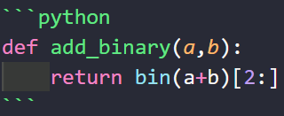

# 实验三 Python列表

班级： 21计科1

学号： B20210302131

姓名： 李佳琪

Github地址：<https://github.com/Seven116>

CodeWars地址：<https://www.codewars.com/users/Seven116>

---

## 实验目的

1. 学习Python的简单使用和列表操作
2. 学习Python中的if语句

## 实验环境

1. Git
2. Python 3.10
3. VSCode
4. VSCode插件

## 实验内容和步骤

### 第一部分

Python列表操作

完成教材《Python编程从入门到实践》下列章节的练习：

- 第3章 列表简介
- 第4章 操作列表
- 第5章 if语句
  
---

### 第二部分

在[Codewars网站](https://www.codewars.com)注册账号，完成下列Kata挑战：

---

#### 第一题：3和5的倍数（Multiples of 3 or 5）

难度： 6kyu

如果我们列出所有低于 10 的 3 或 5 倍数的自然数，我们得到 3、5、6 和 9。这些数的总和为 23. 完成一个函数，使其返回小于某个整数的所有是3 或 5 的倍数的数的总和。此外，如果数字为负数，则返回 0。

注意：如果一个数同时是3和5的倍数，应该只被算一次。

**提示：首先使用列表解析得到一个列表，元素全部是3或者5的倍数。
使用sum函数可以获取这个列表所有元素的和.**

代码提交地址：
<https://www.codewars.com/kata/514b92a657cdc65150000006>

---

#### 第二题： 重复字符的编码器（Duplicate Encoder）

难度： 6kyu

本练习的目的是将一个字符串转换为一个新的字符串，如果新字符串中的每个字符在原字符串中只出现一次，则为"("，如果该字符在原字符串中出现多次，则为")"。在判断一个字符是否是重复的时候，请忽略大写字母。

例如:

```python
"din"      =>  "((("
"recede"   =>  "()()()"
"Success"  =>  ")())())"
"(( @"     =>  "))(("
```

代码提交地址:
<https://www.codewars.com/kata/54b42f9314d9229fd6000d9c>

---

#### 第三题：括号匹配（Valid Braces）

难度：6kyu

写一个函数，接收一串括号，并确定括号的顺序是否有效。如果字符串是有效的，它应该返回True，如果是无效的，它应该返回False。
例如：

```python
"(){}[]" => True 
"([{}])" => True
 "(}" => False
 "[(])" => False 
"[({})](]" => False
```

**提示：
python中没有内置堆栈数据结构，可以直接使用`list`来作为堆栈，其中`append`方法用于入栈，`pop`方法可以出栈。**

代码提交地址
<https://www.codewars.com/kata/5277c8a221e209d3f6000b56>

---

#### 第四题： 从随机三元组中恢复秘密字符串(Recover a secret string from random triplets)

难度： 4kyu


有一个不为你所知的秘密字符串。给出一个随机三个字母的组合的集合，恢复原来的字符串。

这里的三个字母的组合被定义为三个字母的序列，每个字母在给定的字符串中出现在下一个字母之前。"whi "是字符串 "whatisup "的一个三个字母的组合。

作为一种简化，你可以假设没有一个字母在秘密字符串中出现超过一次。

对于给你的三个字母的组合，除了它们是有效的三个字母的组合以及它们包含足够的信息来推导出原始字符串之外，你可以不做任何假设。特别是，这意味着秘密字符串永远不会包含不出现在给你的三个字母的组合中的字母。

测试用例：

```python
secret = "whatisup"
triplets = [
  ['t','u','p'],
  ['w','h','i'],
  ['t','s','u'],
  ['a','t','s'],
  ['h','a','p'],
  ['t','i','s'],
  ['w','h','s']
]
test.assert_equals(recoverSecret(triplets), secret)
```

代码提交地址：
<https://www.codewars.com/kata/53f40dff5f9d31b813000774/train/python>

提示：

- 利用集合去掉`triplets`中的重复字母，得到字母集合`letters`，最后的`secret`应该由集合中的字母组成，`secret`长度也等于该集合。

```python
letters = {letter for triplet in triplets for letter in triplet }
length = len(letters)
```

- 创建函数`check_first_letter(triplets, first_letter)`，检测一个字母是不是secret的首字母，返回True或者False。
- 创建函数`remove_first_letter(triplets, first_letter)`,  从三元组中去掉首字母，返回新的三元组。
- 遍历字母集合letters，利用上面2个函数得到最后的结果`secret`。

---

#### 第五题： 去掉喷子的元音（Disemvowel Trolls）

难度： 7kyu

喷子正在攻击你的评论区!
处理这种情况的一个常见方法是删除喷子评论中的所有元音(字母：a,e,i,o,u)，以消除威胁。
你的任务是写一个函数，接收一个字符串并返回一个去除所有元音的新字符串。
例如，字符串 "This website is for losers LOL!"   将变成 "Ths wbst s fr lsrs LL!".

注意：对于这个Kata来说，y不被认为是元音。
代码提交地址：
<https://www.codewars.com/kata/52fba66badcd10859f00097e>

提示：

- 首先使用列表解析得到一个列表，列表中所有不是元音的字母。
- 使用字符串的join方法连结列表中所有的字母，例如：

```python
last_name = "lovelace"
letters = [letter for letter in last_name ]
print(letters) # ['l', 'o', 'v', 'e', 'l', 'a', 'c', 'e']
name = ''.join(letters) # name = "lovelace"
```

---

### 第三部分

使用Mermaid绘制程序流程图

安装VSCode插件：

- Markdown Preview Mermaid Support
- Mermaid Markdown Syntax Highlighting

使用Markdown语法绘制你的程序绘制程序流程图（至少一个），Markdown代码如下：


显示效果如下：


查看Mermaid流程图语法-->[点击这里](https://mermaid.js.org/syntax/flowchart.html)

使用Markdown编辑器（例如VScode）编写本次实验的实验报告，包括[实验过程与结果](#实验过程与结果)、[实验考查](#实验考查)和[实验总结](#实验总结)，并将其导出为 **PDF格式** 来提交。

## 实验过程与结果

请将实验过程与结果放在这里，包括：

- [第一部分 Python列表操作和if语句](#第一部分)
  
### 第3章 列表简介

3-1姓名

```python
names = ['Tom', 'Seven', 'Mark']
 
print(names[0])
print(names[1])
print(names[2])
```

运行结果：

```python
Tom
Seven
Mark
```

3-2 问候语

```python
names = ['Roy','Rona',"Lily"]
print(f"{names[0]},good morning!")
print(f"{names[1]},good morning!")
print(f"{names[2]},good morning!")
```

运行结果：

```python
Roy,good morning!
Rona,good morning!
Lily,good morning!
```

3-3 自己的列表

```python
bicycles = ['car','Honda motorcycle']
print(f"I would like to own a {bicycles[0]}.")
print(f"I would like to own a {bicycles[1]}.")
```

运行结果：

```python
I would like to own a car.
I would like to own a Honda motorcycle.
```

3-4 嘉宾名单

```python
guests = ['Fancy','Bob','Alice']
print(f"我想要邀请的客人是:{guests[0]},{guests[1]},{guests[2]}")
```

运行结果：

```python
我想要邀请的客人是:Fancy,Bob,Alice
```

3-5 修改嘉宾名单

```python
guests = ['Fancy','Bob','Alice']
print(f"我想要邀请的客人是:{guests[0]},{guests[1]},{guests[2]}")
print(f"但是非常遗憾{guests[0]}无法赴约")
guests.pop(0)
guests.append('Sandra')
print(f"我想邀请的客人是:{guests[0]},{guests[1]},{guests[2]}")
```

运行结果：

```python
我想要邀请的客人是:Fancy,Bob,Alice
但是非常遗憾Fancy无法赴约
我想邀请的客人是:Bob,Alice,Sandra
```

3-6 添加嘉宾
```python
guests = ['Fancy','Bob','Alice']
print(f"我想要邀请的客人是:{guests[0]},{guests[1]},{guests[2]}")

print(f"但是非常遗憾{guests[0]}无法赴约")
guests.pop(0)
guests.append('Sandra')

print(f"我想邀请的客人是:{guests[0]},{guests[1]},{guests[2]}")
print("但是我找到了一个更大的餐桌，我将还会邀请三位朋友")
guests.insert(0,'Cindy')
guests.insert(2,'David')
guests.append('Ella')
print(f"我想要邀请的客人是:{guests[0]},{guests[1]},{guests[2]},{guests[3]},{guests[4]},{guests[5]}")
```

运行结果：

```python
我想要邀请的客人是:Fancy,Bob,Alice
但是非常遗憾Fancy无法赴约
我想邀请的客人是:Bob,Alice,Sandra
但是我找到了一个更大的餐桌，我将还会邀请三位朋友
我想要邀请的客人是:Cindy,Bob,David,Alice,Sandra,Ella
```

3-7 缩减名单
```python
guests = ['Fancy','Bob','Alice']
print(f"我想要邀请的客人是:{guests[0]},{guests[1]},{guests[2]}")
print(f"但是非常遗憾{guests[0]}无法赴约")
guests.pop(0)
guests.append('Sandra')

print(f"我想邀请的客人是:{guests[0]},{guests[1]},{guests[2]}")
print("但是我找到了一个更大的餐桌，我将还会邀请三位朋友")
guests.insert(0,'Cindy')
guests.insert(2,'David')
guests.append('Ella')

print(f"我想要邀请的客人是:{guests[0]},{guests[1]},{guests[2]},{guests[3]},{guests[4]},{guests[5]}")
print("由于一些原因，最后我只能邀请两位客人，非常抱歉")
print(f"我很抱歉无法邀请{guests[5]}你来共进晚餐")
guests.pop()
print(f"我很抱歉无法邀请{guests[4]}你来共进晚餐")
guests.pop()
print(f"我很抱歉无法邀请{guests[3]}你来共进晚餐")
guests.pop()
print(f"我很抱歉无法邀请{guests[2]}你来共进晚餐")
guests.pop()
print(f"{guests[1]},邀请你来共进晚餐")
print(f"{guests[0]},邀请你来共进晚餐")
del guests[1]
del guests[0]
print(guests)
```

运行结果：

```python
我想要邀请的客人是:Fancy,Bob,Alice
但是非常遗憾Fancy无法赴约
我想邀请的客人是:Bob,Alice,Sandra
但是我找到了一个更大的餐桌，我将还会邀请三位朋友    
我想要邀请的客人是:Cindy,Bob,David,Alice,Sandra,Ella
由于一些原因，最后我只能邀请两位客人，非常抱歉      
我很抱歉无法邀请Ella你来共进晚餐
我很抱歉无法邀请Sandra你来共进晚餐
我很抱歉无法邀请Alice你来共进晚餐
我很抱歉无法邀请David你来共进晚餐
Bob,邀请你来共进晚餐
Cindy,邀请你来共进晚餐
```

3-8 放眼世界

```python
cities = ['beijing','yunnan','hangzhou','shanghai','anhui']
print(cities)
print(sorted(cities))
print(cities)
cities.reverse()
print(cities)
cities.reverse()
print(cities)
cities.sort()
print(cities)
cities.sort(reverse=True)
print(cities)
```

运行结果：

```python
['beijing', 'yunnan', 'hangzhou', 'shanghai', 'anhui']
['anhui', 'beijing', 'hangzhou', 'shanghai', 'yunnan']
['beijing', 'yunnan', 'hangzhou', 'shanghai', 'anhui']
['anhui', 'shanghai', 'hangzhou', 'yunnan', 'beijing']
['beijing', 'yunnan', 'hangzhou', 'shanghai', 'anhui']
['anhui', 'beijing', 'hangzhou', 'shanghai', 'yunnan']
['yunnan', 'shanghai', 'hangzhou', 'beijing', 'anhui']
```

3-9 晚餐嘉宾

```python
guests = ['Fancy','Bob','Alice']
print(f"我想要邀请的客人是:{guests[0]},{guests[1]},{guests[2]}")
number = len(guests)
print(f"一共邀请了{number}位客人")
运行结果：

我想要邀请的客人是:Fancy,Bob,Alice
一共邀请了3位客人
```

### 第4章 操作列表

4-1 比萨

```python
pizzas = ["pizza_a","pizza_b","pizza_c"]
for pizza in pizzas:
    print("I Like" + pizza +"!")
print("I like pizza!")
```

运行结果：

```python
I Likepizza_a!
I Likepizza_b!
I Likepizza_c!
I like pizza!
```

4-2 动物

```python
animals=["monkey","snake","rabbit"]
for animal in animals:
    print("My favourite animal is "+ animal +"!")
print("Any oftheseanimals would makea great pet!")
```

运行结果：

```python
My favourite animal is monkey!
My favourite animal is snake!
My favourite animal is rabbit!
Any oftheseanimals would makea great pet!
```

4-3 数到20

```python
for a_number in range(1,21):
    print(a_number)
```

4-4 一百万

```python
numbers = list(range(1,1000001))   #标题要求先创建一个列表
for number in numbers:
    print(number)
```

4-5 计算1~1 000 000的总和

```python
b_numbers = list(range(1,1000001))
print(max(b_numbers))
print(min(b_numbers))
print("最大值为："+str(max(b_numbers))+"；"+"\n最小值为："+str(min(b_numbers))) #字符串只能和字符串拼接，不能直接和int类型拼接
print(sum(b_numbers))
```

运行结果：

```python
1000000
1
最大值为：1000000；
最小值为：1        
500000500000
4-6 奇数
c_numbers = list(range(1,21,2))
for c_number in c_numbers:
    print(c_number)
```

运行结果：

```python
1
3
5
7
9
11
13
15
17
19
```

4-7 3的倍数

```python
numbers = []
for number in range(3,31,3):
    numbers.append(number)
print(numbers)  #仅将数字以一个列表形式打印

numbers = list(range(3,31,3))
for number in numbers:
    print(number)  #for循环代码块中必须有语句，否则会报错
print(numbers)  #先逐一打印数字，再将数字以一个列表形式打印
```

运行结果：

```python
[3, 6, 9, 12, 15, 18, 21, 24, 27, 30]
3
6
9
12
15
18
21
24
27
30
[3, 6, 9, 12, 15, 18, 21, 24, 27, 30]
```

4-8 立方

```python
numbers = []
for number in range(1,11):
    number = number ** 3
    numbers.append(number)
    print(number)
print(numbers)
```

运行结果：

```python
1
8
27
64
125
216
343
512
729
1000
[1, 8, 27, 64, 125, 216, 343, 512, 729, 1000]
```

4-9 立方解析

```python
numbers = [number **3 for number in range(1,11)]
print(numbers)
```

运行结果：

```python
[1, 8, 27, 64, 125, 216, 343, 512, 729, 1000]
4-10 切片
numbers = [number **2 for number in range(1,11)]
print("The first three items in the list are:"+str(numbers[:3]))
print("Three items from the middle of the list are:"+str(numbers[3:6]))
print("The last three items in the list are::"+str(numbers[-3:]))
```

运行结果：

```python
The first three items in the list are:[1, 4, 9]
Three items from the middle of the list are:[16, 25, 36]
The last three items in the list are::[64, 81, 100]
```

4-11 你的比萨和我的比萨

```python
pizzas = ["pizza_a","pizza_b","pizza_c"]
friend_pizzas = pizzas[:]  #复制列表到friend_pizzas中

pizzas.append("pizza_new")
friend_pizzas.append("pizza_new_firend")

print("My favorite pizzas are:")
for pizza in pizzas:
    print(pizza)
    
print("My friend's favorite pizzas are:" )
for pizza in friend_pizzas:
    print(pizza)
```

运行结果：

```python
My favorite pizzas are:
pizza_a
pizza_b
pizza_c
pizza_new
My friend's favorite pizzas are:
pizza_a
pizza_b
pizza_c
pizza_new_firend
4-12 使用多个循环
pizzas = ["pizza_a","pizza_b","pizza_c"]
friend_pizzas = pizzas[:]  #复制列表到friend_pizzas中

pizzas.append("pizza_new")
friend_pizzas.append("pizza_new_firend")

print("My favorite pizzas are:")
for pizza in pizzas:
    print(pizza)
    
print("My friend's favorite pizzas are:" )
for pizza in friend_pizzas:
    print(pizza)
```

运行结果：

```python
My favorite pizzas are:
pizza_a
pizza_b
pizza_c
pizza_new
My friend's favorite pizzas are:
pizza_a
pizza_b
pizza_c
pizza_new_firend
```

4-13 自助餐

```python
foods = ("rice","noodle","apple","meat","potato")

for food in foods:
    print(food)
    
#foods[0]="banana"   直接更改元素会报错 

foods = ("rice_a","noodle_a","apple","meat","potato")
for food in foods:
    print(food)
```

运行结果：

```python
rice
noodle
apple
meat
potato
rice_a
noodle_a
apple
meat
potato
```

### 第5章 if语句

5-1 条件测试

```python
car = 'audi'
print(car == 'subaru')
print(car == 'audi')
 
name = 'Louie'
print(name == 'link')
print(name == 'louie')
print(name.lower() == 'louie')
```

运行结果：

```python
False
True
False
False
True
```

5-2 更多的条件测试

```python
name_1 = 'louie'
name_3 = 'Louie'
# 字符串比较
print(name_1 == name_3)
print(name_1 == name_3.lower())
 
num_1 = 5
num_2 = 9
# 数字比较
print(num_1 == num_2)
print(num_1 != num_2)
print(num_1 > num_2)
print(num_1 < num_2)
 
# 使用 and 和 or 来比较
if num_1 > 5 and num_2 > 5:
    print("This is true")
else:
    print("This is False")
 
if num_1 > 5 or num_2 > 5:
    print("This is true")
else:
    print("This is False")
 
names = ['louie', 'link', 'lisa', 'park']
name = 'links'
 
if name in names:
    print(name + " in the list names")
else:
    print(name + " not in the list names")
```

运行结果：

```python
False
True
False
True
False
True
This is False
This is true
links not in the list names
```

5-3 外星人颜色

```python
alien_color = 'red'
 
if alien_color == 'green':
    print("You got 5 point!~")
else:
    print("Keep up the good work!!!")
```

运行结果：

```python
Keep up the good work!!!
```

5-4 外星人颜色 #2

```python
alien_color = 'red'

if alien_color == 'green':
    print("You got 5 point!~")
else:
    print("You got 10 point!~")
```

运行结果：

```python
You got 10 point!~
```

5-5 外星人颜色 #3

```python
alien_color = 'yellow'
 
if alien_color == 'green':
    print("You got 5 point!~")
elif alien_color == 'yellow':
    print("You got 10 point!~")
else:
    print("You got 15 point!~")
```

运行结果：

```python
You got 10 point!~
5-6 人生的不同阶段
age = 23
 
if age < 2:
    print("baby!~")
elif 2 <= age < 4:
    print("child")
elif 4 <= age < 13:
    print("children")
elif 13 <= age < 20:
    print("teenagers!~")
elif 20 <= age < 65:
    print("adults!~")
else:
    print("The elderly!~")
```

运行结果：

```python
adults!~
```

5-7 喜欢的水果

```python
favorite_fruits = ['banana', 'apple', 'orange']
 
if "apple" in favorite_fruits:
    print("You really like apple!")
if "orange" in favorite_fruits:
    print("You really like orange!")
if "orange" in favorite_fruits:
    print("You really like orange!")
if "milk" in favorite_fruits:
    print("You really like milk!")
else:
    print("The pears not list")
```

运行结果：

```python
You really like apple!
You really like orange!
You really like orange!
The pears not list
```

5-8 以特殊方式跟管理员打招呼

```python
user_names = ['admin', 'link', 'administrator', 'lisa', 'guest']
for user_name in user_names:
    # print("Welcome to " + user_name)
 
    if user_name == 'admin':
        print("Hello admin, would you like to see a status report?")
    else:
        print("Hello Eric, thank you for logging in again")
```

运行结果：

```python
Hello admin, would you like to see a status report?
Hello Eric, thank you for logging in again
Hello Eric, thank you for logging in again
Hello Eric, thank you for logging in again
Hello Eric, thank you for logging in again
```

5-9 处理没有用户的情形

```python
user_names = ['admin', 'link', '', 'administrator', 'lisa', 'guest']
 
for user_name in user_names:
    if user_name == '':
        print("We need to find some users!")
    elif user_name == 'admin':
        print("Hello admin, would you like to see a status report?")
    else:
        print("Hello Eric, thank you for logging in again")
```

运行结果：

```python
Hello admin, would you like to see a status report?
Hello Eric, thank you for logging in again
We need to find some users!
Hello Eric, thank you for logging in again
Hello Eric, thank you for logging in again
Hello Eric, thank you for logging in again
```

5-10 检查用户名

```python
current_users = ['ADMIN', 'link', 'administrator', 'lisa', 'guest']
new_users = ['admin', 'GUEST', 'Park', 'tom', 'jams']
new_current_users = []
 
for current_user in current_users:
    new_current_users.append(current_user.lower())
 
for new_user in new_users:
    if new_user.lower() in new_current_users:
        print("用户名: %s 已被使用，请重新输入！~" % new_user)
    else:
        print("Welcome to back!!\n" + new_user)
```

运行结果：

```python
用户名: admin 已被使用，请重新输入！~
用户名: GUEST 已被使用，请重新输入！~
Welcome to back!!
Park
Welcome to back!!
tom
Welcome to back!!
jams
```

5-11 序数

```python
nums = ['1', '2', '3', '4', '5', '6', '7', '8', '9']
 
for num in nums:
    if num == "1":
        print("1st")
    elif num == "2":
        print("2nd")
    elif num == "3":
        print("3rd")
    else:
        print(num + "th")
```

运行结果：

```python
1st
2nd
3rd
4th
5th
6th
7th
8th
9th
```

[第二部分 Codewars Kata挑战](#第二部分)

#### 第一题：3和5的倍数（Multiples of 3 or 5）

```python
    def solution(number):
    
    # 从0到number-1的整数
    numbers = [i for i in range(number)]
    
    # 从0到number-1的整数中，3或者5的倍数
    multi3or5 =  [i for i in range(number) if i%3==0 or i%5==0]
    
    # 返回结果
    return sum(multi3or5) 
```

#### 第二题： 重复字符的编码器（Duplicate Encoder）

```python
def duplicate_encode(word):
    # 用来保存括号的列表
    result = []
    
    # 将所有字符全部变成小写
    word = word.lower()
    
    # 遍历单词中所有的字符
    for c in word:
        # 如果该字符出现次数大于1次，在列表中添加`)`
        if word.count(c) > 1:
            result.append(')')
        # 如果该字符出现次数大于1次，在列表中添加`(`
        else:
            result.append('(') 
    
    # 将列表中的括号连接成字符串返回
    return ''.join(result)
```

#### 第三题：括号匹配（Valid Braces）

```python
braces = "(){}[]" 
def validBraces(string):
    stack = [] # 用来保存括号的栈
    for c in string:
        # 如果是左括号，就入栈
        if c in '({[':
            stack.append(c)
        # 如果是右括号
        elif c in ')}]':
            # 如果栈为空，返回False
            if not stack:
                return False
            # 如果栈顶元素和当前元素不匹配，返回False
            if stack[-1] != braces[braces.index(c)-1]:
                return False
            # 如果栈顶元素和当前元素匹配，就出栈
            else:
                stack.pop()
    # 如果栈为空，返回True
    if not stack:
        return True
    # 如果栈不为空，返回False
    else:
        return False
```

#### 第四题： 从随机三元组中恢复秘密字符串(Recover a secret string from random triplets)

```python
def recoverSecret(triplets):
    res = list({i for t in triplets for i in t})#根据triplets生成原字符串的字符列表，无重复，但非按顺序。
    for t in triplets * 2:#循环遍历triplets，每次循环按三字符列表中的顺序调整res中字符顺序。
        fix(res, t[0], t[1])
        fix(res, t[1], t[2])
    return ''.join(res)

def fix(t, a, b):
    if t.index(a) > t.index(b):
        t.remove(a)
        t.insert(t.index(b), a)

```

#### 第五题： 去掉喷子的元音（Disemvowel Trolls）

```python
def disemvowel(string_):
    res = ''
    yuan = 'aeiouAEIOU'#元音字符串包括所有元音的大小写
    for x in string_:
        if x not in yuan:
            res += x
    return res
```

 [第三部分 使用Mermaid绘制程序流程图](#第三部分)

#### 第一题：3和5的倍数（Multiples of 3 or 5）


#### 第二题： 重复字符的编码器（Duplicate Encoder）


#### 第三题：括号匹配（Valid Braces）


#### 第四题： 从随机三元组中恢复秘密字符串(Recover a secret string from random triplets)


#### 第五题： 去掉喷子的元音（Disemvowel Trolls）


注意代码需要使用markdown的代码块格式化，例如Git命令行语句应该使用下面的格式：


显示效果如下：

```bash
git init
git add .
git status
git commit -m "first commit"
```

如果是Python代码，应该使用下面代码块格式，例如：



显示效果如下：

```python
def add_binary(a,b):
    return bin(a+b)[2:]
```

代码运行结果的文本可以直接粘贴在这里。

**注意：不要使用截图，Markdown文档转换为Pdf格式后，截图可能会无法显示。**

## 实验考查

请使用自己的语言并使用尽量简短代码示例回答下面的问题，这些问题将在实验检查时用于提问和答辩以及实际的操作。

**1. Python中的列表可以进行哪些操作？**

+ 创建列表：使用方括号 [] 或 list() 函数来创建一个列表。
+ 访问元素：通过索引来访问列表中的元素。
+ 更新元素：通过索引来更新列表中的元素。
+ 列表切片：获取列表的一个子集。
+ 列表追加：使用 append() 方法在列表的末尾添加元素。
+ 列表插入：使用 insert() 方法在列表的指定位置插入元素。
+ 列表删除：使用 remove() 方法删除列表中的指定元素或使用 del 语句删除指定索引的元素。
+ 列表长度：使用 len() 函数获取列表的长度。
+ 列表排序：使用 sort() 方法对列表进行排序。
+ 列表反转：使用 reverse() 方法反转列表。

**2. 哪两种方法可以用来对Python的列表排序？这两种方法有何区别？**

Python中有两种主要的排序列表的方法：内置的 sort() 函数和 sorted() 函数。<br>
sorted() 是非原地排序，它会创建一个新的排序列表，而原始列表保持不变。这个函数有返回值，即排序后的新列表。
list.sort() 是原地排序，这意味着它会直接修改原始列表。这种方法没有返回值（或者更准确地说，它的返回值是None）<br>
sort() 方法只适用于列表，而 sorted() 函数可以接受任何可迭代的输入<br>
在选择使用哪种方法时，主要取决于是否需要保留原始列表不变。如果不需要保留原始列表，通常使用 sort() 方法会更高效，因为它不需要额外的内存来创建新的列表。如果需要保留原始列表，那么就应该使用 sorted() 函数。

**3. 如何将Python列表逆序打印？**

方法一：使用列表的 reverse() 方法。这个方法会改变原列表的顺序，将列表元素逆序排列。

方法二：使用切片操作。这种方法不会改变原列表的顺序，而是创建一个新的逆序列表。

**4. Python中的列表执行哪些操作时效率比较高？哪些操作效率比较差？是否有类似的数据结构可以用来替代列表？**

+ 访问元素：列表在访问元素时效率很高，时间复杂度为O。
+ 追加元素：使用append()方法在列表末尾添加元素时效率很高，时间复杂度为O(1)。
+ 插入元素：使用insert()方法在列表的开头或中间插入元素时效率较低，时间复杂度为O(n)。
+ 删除元素：使用remove()或del方法删除列表中的元素时效率较低，时间复杂度为O(n)。
+ 搜索元素：使用in关键字或list.index()方法搜索列表中的元素时效率较低，时间复杂度为O(n)。
  
+ 如果需要更高效的数据结构来替代列表，可以考虑使用以下数据结构：

+ 元组(tuple)：如果不需要修改数据，可以使用元组代替列表，元组是不可变的，因此它们比列表更安全，并且在某些情况下更高效。
+ 集合(set)：如果需要存储唯一元素的无序集合，可以使用集合代替列表，集合的插入、删除和搜索操作都比列表更高效。
+ 字典(dict)：如果需要存储键值对的数据结构，可以使用字典代替列表，字典的插入、删除和搜索操作都比列表更高效。
  
**5. 阅读《Fluent Python》Chapter 2. An Array of Sequence - Tuples Are Not Just Immutable Lists小节（p30-p35）。总结该小节的主要内容。**

- 元组是不可变的序列，与列表（list）类似，但元组的元素无法被修改。
- 元组使用圆括号()创建，而列表使用方括号[]。
元组可以用于存储一组相关的值，例如坐标点(x, y)。
- 元组可以作为字典（dictionary）的键，而列表不能。这是因为字典的键必须是不可变的。
- 元组支持常见的序列操作，如索引、切片和拼接。
- 尽管元组是不可变的，但如果元组中包含可变元素（如列表），那么这些可变元素是可以被修改的。也就是说，元组的不可变性是浅层次的。

总的来说，这个小节详细解释了元组的特性、用法以及它和列表的区别。

## 实验总结

总结一下这次实验你学习和使用到的知识，例如：编程工具的使用、数据结构、程序语言的语法、算法、编程技巧、编程思想。

通过实验三的学习，对如何创建列表，以及如何通过索引访问、切片、迭代等方式操作列表中的元素有了一定了解。提高了自己对python列表的常用方法的运用。继续练习Codewars上的算法习题。课后也可以适当增加实验时间和练习数量，来提高自己的编程能力，以此来更加深入地学习和使用python。