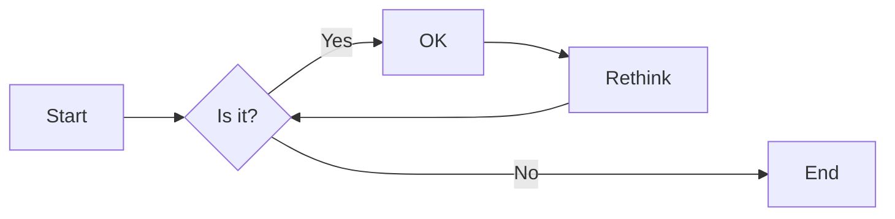
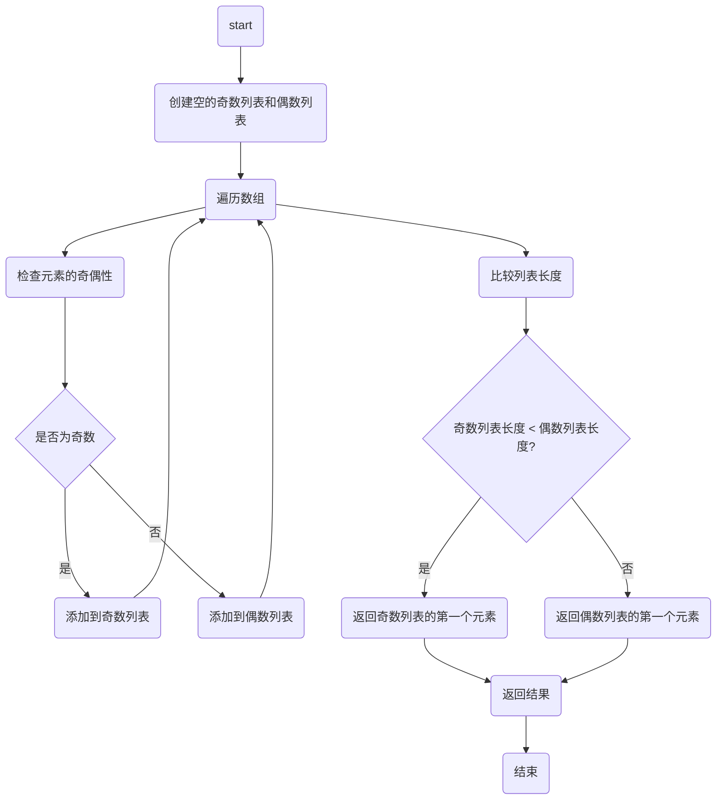

# 实验五 Python数据结构与数据模型

班级： 21计科1

学号： B20210302131

姓名： 李佳琪

Github地址：<https://github.com/Seven116>

CodeWars地址：<https://www.codewars.com/users/Seven116>

---

## 实验目的

1. 学习Python数据结构的高级用法
2. 学习Python的数据模型

## 实验环境

1. Git
2. Python 3.10
3. VSCode
4. VSCode插件

## 实验内容和步骤

### 第一部分

在[Codewars网站](https://www.codewars.com)注册账号，完成下列Kata挑战：

---

#### 第一题：停止逆转我的单词

难度： 6kyu

编写一个函数，接收一个或多个单词的字符串，并返回相同的字符串，但所有5个或更多的字母单词都是相反的（就像这个Kata的名字一样）。传入的字符串将只由字母和空格组成。只有当出现一个以上的单词时，才会包括空格。
例如：

```python
spinWords( "Hey fellow warriors" ) => returns "Hey wollef sroirraw" 
spinWords( "This is a test") => returns "This is a test" 
spinWords( "This is another test" )=> returns "This is rehtona test"
```

代码提交地址：
<https://www.codewars.com/kata/5264d2b162488dc400000001>

提示：

- 利用str的split方法可以将字符串分为单词列表
例如：

```python
words = "hey fellow warrior".split()
# words should be ['hey', 'fellow', 'warrior']
```

- 利用列表推导将长度大于等于5的单词反转(利用切片word[::-1])
- 最后使用str的join方法连结列表中的单词。

---

#### 第二题： 发现离群的数(Find The Parity Outlier)

难度：6kyu

给你一个包含整数的数组（其长度至少为3，但可能非常大）。该数组要么完全由奇数组成，要么完全由偶数组成，除了一个整数N。请写一个方法，以该数组为参数，返回这个 "离群 "的N。

例如：

```python
[2, 4, 0, 100, 4, 11, 2602, 36]
# Should return: 11 (the only odd number)

[160, 3, 1719, 19, 11, 13, -21]
# Should return: 160 (the only even number)
```

代码提交地址：
<https://www.codewars.com/kata/5526fc09a1bbd946250002dc>

---

#### 第三题： 检测Pangram

难度：6kyu

pangram是一个至少包含每个字母一次的句子。例如，"The quick brown fox jumps over the lazy dog "这个句子就是一个pangram，因为它至少使用了一次字母A-Z（大小写不相关）。

给定一个字符串，检测它是否是一个pangram。如果是则返回`True`，如果不是则返回`False`。忽略数字和标点符号。
代码提交地址：
<https://www.codewars.com/kata/545cedaa9943f7fe7b000048>

---

#### 第四题： 数独解决方案验证

难度：6kyu

数独背景

数独是一种在 9x9 网格上进行的游戏。游戏的目标是用 1 到 9 的数字填充网格的所有单元格，以便每一列、每一行和九个 3x3 子网格（也称为块）中的都包含数字 1 到 9。更多信息请访问：<http://en.wikipedia.org/wiki/Sudoku>

编写一个函数接受一个代表数独板的二维数组，如果它是一个有效的解决方案则返回 true，否则返回 false。数独板的单元格也可能包含 0，这将代表空单元格。包含一个或多个零的棋盘被认为是无效的解决方案。棋盘总是 9 x 9 格，每个格只包含 0 到 9 之间的整数。

代码提交地址：
<https://www.codewars.com/kata/63d1bac72de941033dbf87ae>

---

#### 第五题： 疯狂的彩色三角形

难度： 2kyu

一个彩色的三角形是由一排颜色组成的，每一排都是红色、绿色或蓝色。连续的几行，每一行都比上一行少一种颜色，是通过考虑前一行中的两个相接触的颜色而产生的。如果这些颜色是相同的，那么新的一行就使用相同的颜色。如果它们不同，则在新的一行中使用缺失的颜色。这个过程一直持续到最后一行，只有一种颜色被生成。

例如：

```python
Colour here:            G G        B G        R G        B R
Becomes colour here:     G          R          B          G
```

一个更大的三角形例子：

```python
R R G B R G B B
 R B R G B R B
  G G B R G G
   G R G B G
    B B R R
     B G R
      R B
       G
```

你将得到三角形的第一行字符串，你的工作是返回最后的颜色，这将出现在最下面一行的字符串。在上面的例子中，你将得到 "RRGBRGBB"，你应该返回 "G"。
限制条件： 1 <= length(row) <= 10 ** 5
输入的字符串将只包含大写字母'B'、'G'或'R'。

例如：

```python
triangle('B') == 'B'
triangle('GB') == 'R'
triangle('RRR') == 'R'
triangle('RGBG') == 'B'
triangle('RBRGBRB') == 'G'
triangle('RBRGBRBGGRRRBGBBBGG') == 'G'
```

代码提交地址：
<https://www.codewars.com/kata/5a331ea7ee1aae8f24000175>

提示：请参考下面的链接，利用三进制的特点来进行计算。
<https://stackoverflow.com/questions/53585022/three-colors-triangles>

---

### 第二部分

使用Mermaid绘制程序流程图

安装VSCode插件：

- Markdown Preview Mermaid Support
- Mermaid Markdown Syntax Highlighting

使用Markdown语法绘制你的程序绘制程序流程图（至少一个），Markdown代码如下：


显示效果如下：



查看Mermaid流程图语法-->[点击这里](https://mermaid.js.org/syntax/flowchart.html)

使用Markdown编辑器（例如VScode）编写本次实验的实验报告，包括[实验过程与结果](#实验过程与结果)、[实验考查](#实验考查)和[实验总结](#实验总结)，并将其导出为 **PDF格式** 来提交。

## 实验过程与结果

请将实验过程与结果放在这里，包括：

- [第一部分 Codewars Kata挑战](#第一部分)
  
#### 第一题：停止逆转我的单词

```python
  def spin_words(str):
    str = str.split(" ")
    return " ".join([i[::-1] if len(i) >= 5 else i for i in str])
```

#### 第二题： 发现离群的数(Find The Parity Outlier)

```python
def find_outlier(int):
    # 保存所有奇数
    odds = [x for x in int if x%2!=0]
    
    # 保存所有偶数
    evens= [x for x in int if x%2==0]
    
    # 比较偶数列表和奇数列表的长度，返回长度较小的列表的第一个元素
    return odds[0] if len(odds)<len(evens) else evens[0]
```

#### 第三题： 检测Pangram

```python
  def is_pangram(s):
    s = s.lower()
    for char in 'abcdefghijklmnopqrstuvwxyz':
        if char not in s:
            return False
    return True
```

#### 第四题： 数独解决方案验证

```python
def validate_sudoku(board):
    elements = set(range(1, 10))
    for b in board:
        if set(b) != elements: 
            return False
    for b in zip(*board):   # zip(*board) 可以将矩阵转置
        if set(b) != elements: 
            return False

    for i in range(3, 10, 3):
        for j in range(3, 10, 3):
            if elements != {(board[q][w]) 
                            for w in range(j-3, j) 
                            for q in range(i-3, i)}:
                return False
            
    return True
```

#### 第五题： 疯狂的彩色三角形

```python
  def triangle(row):
    reduce=[3**i+1 for i in range(10) if 3**i<=100000][::-1]
    
    COLOR = {'GG':'G', 'BB':'B', 'RR':'R', 'BR':'G', 
            'BG':'R', 'GB':'R', 'GR':'B', 'RG':'B', 'RB':'G'}
    for length in reduce:
        while len(row)>=length:
            row=[ COLOR[row[i] + row[i+length-1]] for i in range(len(row)-length+1)]
    return row[0]
```

- [第二部分 使用Mermaid绘制程序流程图](#第二部分)
  
#### 第二题:发现离群的数(Find The Parity Outlier)



注意代码需要使用markdown的代码块格式化，例如Git命令行语句应该使用下面的格式：


显示效果如下：

```bash
git init
git add .
git status
git commit -m "first commit"
```

如果是Python代码，应该使用下面代码块格式，例如：


显示效果如下：

```python
def add_binary(a,b):
    return bin(a+b)[2:]
```

代码运行结果的文本可以直接粘贴在这里。

**注意：不要使用截图，因为Markdown文档转换为Pdf格式后，截图会无法显示。**

## 实验考查

请使用自己的语言并使用尽量简短代码示例回答下面的问题，这些问题将在实验检查时用于提问和答辩以及实际的操作。

**1. 集合（set）类型有什么特点？它和列表（list）类型有什么区别？**
**集合（set）类型具有以下特点：**

- 无序性：集合中的元素没有特定的顺序。
- 唯一性：集合中的元素都是唯一的，不会有重复的元素。
- 可变性：集合中的元素可以添加和删除。
- 集合本身是可迭代的。
  
**列表（list）类型具有以下特性：**

- 有序性：列表中的元素有特定的顺序，可以通过索引访问。
- 可重复性：列表中的元素可以重复。
- 可变性：列表中的元素可以添加、删除和改变。
  
**因此，集合和列表的主要区别在于：**

- 元素是否有序：列表中的元素是有序的，而集合中的元素是无序的。
- 元素是否唯一：列表中的元素可以重复，而集合中的元素都是唯一的。

**2. 集合（set）类型主要有那些操作？**

- 添加元素：使用 add() 方法向集合中添加一个元素。
- 删除元素：使用 remove() 方法从集合中删除一个元素。
- 计算交集：使用 intersection() 方法或 & 运算符计算两个集合的交集，返回一个新集合，包含同时存在于两个集合中的元素。
- 计算并集：使用 union() 方法或 | 运算符计算两个集合的并集，返回一个新集合，包含存在于任何一个集合中的元素。
- 计算差集：使用 difference() 方法或 - 运算符计算两个集合的差集，返回一个新集合，包含存在于第一个集合但不存在于第二个集合中的元素。
- 判断子集和超集：使用 issubset() 和 issuperset() 方法判断一个集合是否为另一个集合的子集或超集。
- 检查元素是否存在：使用 in 或 not in 运算符检查一个元素是否存在于集合中。

**3. 使用`*`操作符作用到列表上会产生什么效果？为什么不能使用`*`操作符作用到嵌套的列表上？使用简单的代码示例说明。**

1、复制列表：如果在一个列表前面加上*，那么会返回这个列表的一个副本。例如：

```python
list1 = [1, 2, 3]  
list2 = *list1  
print(list2)  # 输出：[1, 2, 3]
```

2、解包列表（或元组）：当*出现在一个函数调用中时，它通常被用来解包一个列表（或元组）。例如：

```python
list1 = [1, 2, 3]  
print(*list1)  # 输出：1 2 3
```

如果将 * 作用于嵌套的列表，它将重复嵌套列表本身而不是列表中的元素。

**4. 总结列表,集合，字典的解析（comprehension）的使用方法。使用简单的代码示例说明。**

1、列表解析:列表解析是创建新列表的一种方法，它通过一个表达式后面跟随一个for语句来为表达式中的每个元素执行一个操作。

2、集合解析:
集合解析与列表解析非常相似，唯一的区别是集合解析的结果是一个集合，而列表解析的结果是一个列表。此外，集合是无序的，所以每个元素在结果中出现的次数可能会比原始列表中的次数更多。

3、字典解析：字典解析是创建新字典的一种方法，它使用一个表达式后面跟随两个for语句来为表达式中的每个元素创建一个键值对。第一个for用于创建键，第二个for用于创建值。

## 实验总结

**总结一下这次实验你学习和使用到的知识，例如：编程工具的使用、数据结构、程序语言的语法、算法、编程技巧、编程思想。**

Python数据结构和数据模型是Python编程中非常重要的两个应用。通过实验可以深入理解数据结构的基本概念、原理和方法，以及数据模型在解决实际问题中的应用。通过实验，我们不仅加深了对Python数据结构和数据模型是的理解，结合使用数据结构和数据模型，还提高了编程能力和问题解决能力。同时培养了解决实际问题的能力。