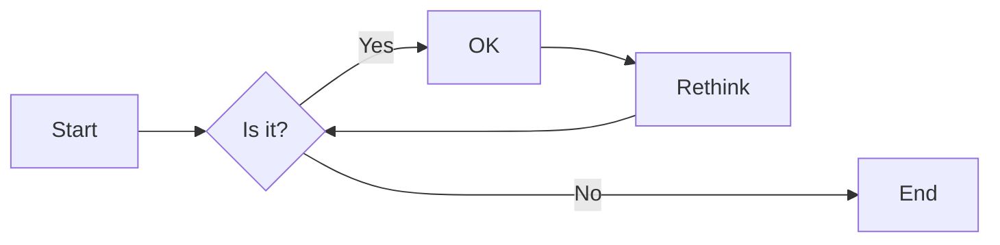
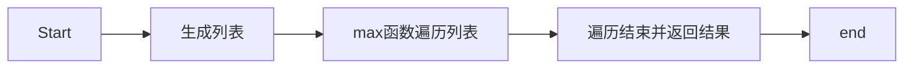

# 实验六 Python函数

班级： 21计科1

学号： B20210302131

姓名： 李佳琪

Github地址：<https://github.com/Seven116>

CodeWars地址：<https://www.codewars.com/users/Seven116>

---

## 实验目的

1. 学习Python函数的基本用法
2. 学习lambda函数和高阶函数的使用
3. 掌握函数式编程的概念和实践

## 实验环境

1. Git
2. Python 3.10
3. VSCode
4. VSCode插件

## 实验内容和步骤

### 第一部分

Python函数

完成教材《Python编程从入门到实践》下列章节的练习：

- 第8章 函数

---

### 第二部分

在[Codewars网站](https://www.codewars.com)注册账号，完成下列Kata挑战：

---

#### 第一题：编码聚会1

难度： 7kyu

你将得到一个字典数组，代表关于首次报名参加你所组织的编码聚会的开发者的数据。
你的任务是返回来自欧洲的JavaScript开发者的数量。
例如，给定以下列表：

```python
lst1 = [
  { 'firstName': 'Noah', 'lastName': 'M.', 'country': 'Switzerland', 'continent': 'Europe', 'age': 19, 'language': 'JavaScript' },
  { 'firstName': 'Maia', 'lastName': 'S.', 'country': 'Tahiti', 'continent': 'Oceania', 'age': 28, 'language': 'JavaScript' },
  { 'firstName': 'Shufen', 'lastName': 'L.', 'country': 'Taiwan', 'continent': 'Asia', 'age': 35, 'language': 'HTML' },
  { 'firstName': 'Sumayah', 'lastName': 'M.', 'country': 'Tajikistan', 'continent': 'Asia', 'age': 30, 'language': 'CSS' }
]
```

你的函数应该返回数字1。
如果，没有来自欧洲的JavaScript开发人员，那么你的函数应该返回0。

注意：
字符串的格式将总是"Europe"和"JavaScript"。
所有的数据将始终是有效的和统一的，如上面的例子。

这个卡塔是Coding Meetup系列的一部分，其中包括一些简短易行的卡塔，这些卡塔是为了让人们掌握高阶函数的使用。在Python中，这些方法包括：`filter`, `map`, `reduce`。当然也可以采用其他方法来解决这些卡塔。

[代码提交地址](https://www.codewars.com/kata/coding-meetup-number-1-higher-order-functions-series-count-the-number-of-javascript-developers-coming-from-europe)

---

#### 第二题： 使用函数进行计算

难度：5kyu

这次我们想用函数来写计算，并得到结果。让我们看一下一些例子：

```python
seven(times(five())) # must return 35
four(plus(nine())) # must return 13
eight(minus(three())) # must return 5
six(divided_by(two())) # must return 3
```

要求：

- 从0（"零"）到9（"九"）的每个数字都必须有一个函数。
- 必须有一个函数用于以下数学运算：加、减、乘、除。
- 每个计算都由一个操作和两个数字组成。
- 最外面的函数代表左边的操作数，最里面的函数代表右边的操作数。
- 除法应该是整数除法。

例如，下面的计算应该返回2，而不是2.666666...。

```python
eight(divided_by(three()))
```

代码提交地址：
<https://www.codewars.com/kata/525f3eda17c7cd9f9e000b39>

---

#### 第三题： 缩短数值的过滤器(Number Shortening Filter)

难度：6kyu

在这个kata中，我们将创建一个函数，它返回另一个缩短长数字的函数。给定一个初始值数组替换给定基数的 X 次方。如果返回函数的输入不是数字字符串，则应将输入本身作为字符串返回。

例子：

```python
filter1 = shorten_number(['','k','m'],1000)
filter1('234324') == '234k'
filter1('98234324') == '98m'
filter1([1,2,3]) == '[1,2,3]'
filter2 = shorten_number(['B','KB','MB','GB'],1024)
filter2('32') == '32B'
filter2('2100') == '2KB';
filter2('pippi') == 'pippi'
```

代码提交地址：
<https://www.codewars.com/kata/56b4af8ac6167012ec00006f>

---

#### 第四题： 编码聚会7

难度： 6kyu

您将获得一个对象序列，表示已注册参加您组织的下一个编程聚会的开发人员的数据。

您的任务是返回一个序列，其中包括最年长的开发人员。如果有多个开发人员年龄相同，则将他们按照在原始输入数组中出现的顺序列出。

例如，给定以下输入数组：

```python
list1 = [
  { 'firstName': 'Gabriel', 'lastName': 'X.', 'country': 'Monaco', 'continent': 'Europe', 'age': 49, 'language': 'PHP' },
  { 'firstName': 'Odval', 'lastName': 'F.', 'country': 'Mongolia', 'continent': 'Asia', 'age': 38, 'language': 'Python' },
  { 'firstName': 'Emilija', 'lastName': 'S.', 'country': 'Lithuania', 'continent': 'Europe', 'age': 19, 'language': 'Python' },
  { 'firstName': 'Sou', 'lastName': 'B.', 'country': 'Japan', 'continent': 'Asia', 'age': 49, 'language': 'PHP' },
]
```

您的程序应该返回如下结果：

```python
[
  { 'firstName': 'Gabriel', 'lastName': 'X.', 'country': 'Monaco', 'continent': 'Europe', 'age': 49, 'language': 'PHP' },
  { 'firstName': 'Sou', 'lastName': 'B.', 'country': 'Japan', 'continent': 'Asia', 'age': 49, 'language': 'PHP' },
]
```

注意：

- 输入的列表永远都包含像示例中一样有效的正确格式的数据，而且永远不会为空。

代码提交地址：
<https://www.codewars.com/kata/582887f7d04efdaae3000090>

---

#### 第五题： Currying versus partial application

难度： 4kyu

[Currying versus partial application](https://2ality.com/2011/09/currying-vs-part-eval.html)是将一个函数转换为具有更小arity(参数更少)的另一个函数的两种方法。虽然它们经常被混淆，但它们的工作方式是不同的。目标是学会区分它们。

Currying

是一种将接受多个参数的函数转换为以每个参数都只接受一个参数的一系列函数链的技术。

Currying接受一个函数：

```python
f：X × Y → R
```

并将其转换为一个函数：

```python
f'：X → (Y → R)
```

我们不再使用两个参数调用f，而是使用第一个参数调用f'。结果是一个函数，然后我们使用第二个参数调用该函数来产生结果。因此，如果非curried f被调用为：

```python
f(3, 5)
```

那么curried f'被调用为：

```python
f'(3)(5)
```

示例
给定以下函数：

```python
def add(x, y, z):
  return x + y + z
```

我们可以以普通方式调用：

```python
add(1, 2, 3) # => 6
```

但我们可以创建一个curried版本的add(a, b, c)函数：

```python
curriedAdd = lambda a: (lambda b: (lambda c: add(a,b,c)))
curriedAdd(1)(2)(3) # => 6
```

Partial application
是将一定数量的参数固定到函数中，从而产生另一个更小arity(参数更少)的函数的过程。

部分应用接受一个函数：

```python
f：X × Y → R
```

和一个固定值x作为第一个参数，以产生一个新的函数

```python
f'：Y → R
```

f'与f执行的操作相同，但只需要填写第二个参数，这就是其arity比f的arity少一个的原因。可以说第一个参数绑定到x。

示例:

```python
partialAdd = lambda a: (lambda *args: add(a,*args))
partialAdd(1)(2, 3) # => 6
```

你的任务是实现一个名为curryPartial()的通用函数，可以进行currying或部分应用。

例如：

```python
curriedAdd = curryPartial(add)
curriedAdd(1)(2)(3) # => 6

partialAdd = curryPartial(add, 1)
partialAdd(2, 3) # => 6
```

我们希望函数保持灵活性。

所有下面这些例子都应该产生相同的结果：

```python
curryPartial(add)(1)(2)(3) # =>6 
curryPartial(add, 1)(2)(3) # =>6 
curryPartial(add, 1)(2, 3) # =>6 
curryPartial(add, 1, 2)(3) # =>6 
curryPartial(add, 1, 2, 3) # =>6 
curryPartial(add)(1, 2, 3) # =>6 
curryPartial(add)(1, 2)(3) # =>6 
curryPartial(add)()(1, 2, 3) # =>6 
curryPartial(add)()(1)()()(2)(3) # =>6 

curryPartial(add)()(1)()()(2)(3, 4, 5, 6) # =>6 
curryPartial(add, 1)(2, 3, 4, 5) # =>6 

curryPartial(curryPartial(curryPartial(add, 1), 2), 3) # =>6
curryPartial(curryPartial(add, 1, 2), 3) # =>6
curryPartial(curryPartial(add, 1), 2, 3) # =>6
curryPartial(curryPartial(add, 1), 2)(3) # =>6
curryPartial(curryPartial(add, 1)(2), 3) # =>6
curryPartial(curryPartial(curryPartial(add, 1)), 2, 3) # =>6
```

代码提交地址：
<https://www.codewars.com/kata/53cf7e37e9876c35a60002c9>

---

### 第三部分

使用Mermaid绘制程序流程图

安装VSCode插件：

- Markdown Preview Mermaid Support
- Mermaid Markdown Syntax Highlighting

使用Markdown语法绘制你的程序绘制程序流程图（至少一个），Markdown代码如下：


显示效果如下：



查看Mermaid流程图语法-->[点击这里](https://mermaid.js.org/syntax/flowchart.html)

使用Markdown编辑器（例如VScode）编写本次实验的实验报告，包括[实验过程与结果](#实验过程与结果)、[实验考查](#实验考查)和[实验总结](#实验总结)，并将其导出为 **PDF格式** 来提交。

## 实验过程与结果

请将实验过程与结果放在这里，包括：

- [第一部分 Python函数](#第一部分)
  
8-1 消息：编写一个名为display_message()的函数，它打印一个句子，指出你在本章学的是什么。调用这个函数，确认显示的消息正确无误。

```python
def display_message():
    print("function!")
display_message()
```

8-2 喜欢的图书：编写一个名为favorite_book()的函数，其中包含一个名为title的形参。这个函数打印一条消息，如One of my favorite books is Alice in Wonderland。调用这个函数，并将一本图书的名称作为实参传递给它。

```python
def favorite_book(title):
    print(f"One of my favorite books is {title}。")
favorite_book("Alice in Wonderland")
```

8-3 T恤：编写一个名为make_shirt()的函数，它接受一个尺码以及要印到T恤上的字样。这个函数应打印一个句子，概要地说明T恤的尺码和字样。使用位置实参调用这个函数来制作一件T恤；再使用关键字实参来调用这个函数。

```python
def make_shirt(size, message):
    print(f"your shirt's size is {size}, and the message is {message}")

make_shirt(1, "hello1")
make_shirt(size=2, message="hello2")
make_shirt(message="hello3", size=3)
```

8-4 大号T恤：修改函数make_shirt()，使其在默认情况下制作一件印有字样“I love Python”的大号T恤。调用这个函数来制作如下T恤：一件印有默认字样的大号T恤、一件印有默认字样的中号T恤和一件印有其他字样的T恤（尺码无关紧要）。

```python
def make_shirt(size="big", message="i love python"):
    print(f"your shirt's size is {size}, and the message is {message}")

make_shirt()
make_shirt(size="middle")
make_shirt(message="hello3", size=3)
```

8-5 城市：编写一个名为describe_city()的函数，它接受一座城市的名字以及该城市所属的国家。这个函数应打印一个简单的句子，如Reykjavik is in Iceland。给用于存储国家的形参指定默认值。为三座不同的城市调用这个函数，且其中至少有一座城市不属于默认国家。

```python
def describe_city(city, country="china"):
    print(f"{city} is in {country}")

describe_city("reykjavik", "iceland")
describe_city("beijing")
describe_city("shanghai", "china")
```

8-6 城市名：编写一个名为city_country()的函数，它接受城市的名称及其所属的国家。这个函数应返回一个格式类似于下面这样的字符串：
   "Santiago, Chile"
至少使用三个城市-国家对调用这个函数，并打印它返回的值。

```python
def city_country(city, country):
    message = city +', ' + country
    return message

print(city_country("Santiago", "Chile"))
print(city_country("london", "england"))
print(city_country("beijing", "china"))
```

8-7 专辑：编写一个名为make_album()的函数，它创建一个描述音乐专辑的字典。这个函数应接受歌手的名字和专辑名，并返回一个包含这两项信息的字典。使用这个函数创建三个表示不同专辑的字典，并打印每个返回的值，以核实字典正确地存储了专辑的信息。

给函数make_album()添加一个可选形参，以便能够存储专辑包含的歌曲数。如果调用这个函数时指定了歌曲数，就将这个值添加到表示专辑的字典中。调用这个函数，并至少在一次调用中指定专辑包含的歌曲数。

```python
def make_album(singer, album, number=""):
    album = {'album_name': album, 'singer_name': singer}
    if number:
        album["number"] = number
    return album

album1 = make_album("A", "aa")
print(album1)

album2 = make_album("A", "aa", '3')
print(album2)
```

8-8 用户的专辑：在为完成练习8-7编写的程序中，编写一个while循环，让用户输入一个专辑的歌手和名称。获取这些信息后，使用它们来调用函数make_album()，并将创建的字典打印出来。在这个while循环中，务必要提供退出途径。

```python
def make_album(singer, album, number=""):
    album = {'album_name': album, 'singer_name': singer}
    if number:
        album["number"] = number
    return album

while True:
    print("\nplease enter the album information:")
    print("(enter 'q' at any to quit.)")

    album_name = input("album name: > ")
    if album_name == 'q':
        break

    singer_name = input("singer name: > ")
    if singer_name == 'q':
        break

    a = make_album(album_name, singer_name)
    print(a)
```

8-9 魔术师：创建一个包含魔术师名字的列表，并将其传递给一个名为show_magicians()的函数，这个函数打印列表中每个魔术师的名字。

```python
magician_list = ['a','b','c']

def show_magicians(magicians):
    for magician in magicians:
        print(magician)

show_magicians(magician_list)
```

8-10 了不起的魔术师：在你为完成练习8-9而编写的程序中，编写一个名为make_great()的函数，对魔术师列表进行修改，在每个魔术师的名字中都加入字样“the Great”。调用函数show_magicians()，确认魔术师列表确实变了。

```python
magician_list = ['a','b','c']

def show_magicians(magicians):
    for magician in magicians:
        print(magician)


def make_great(magician_list):
    for i in range(0, len(magician_list)):
        magician_list[i] = "the Great " + magician_list[i]


make_great(magician_list)

show_magicians(magician_list)
```

8-11 不变的魔术师：修改你为完成练习8-10而编写的程序，在调用函数make_great()时，向它传递魔术师列表的副本。由于不想修改原始列表，请返回修改后的列表，并将其存储到另一个列表中。分别使用这两个列表来调用show_magicians()，确认一个列表包含的是原来的魔术师名字，而另一个列表包含的是添加了字样“the Great”的魔术师名字。

```python
magician_list = ['a','b','c']
magician_new =[]

def show_magicians(magicians):
    for magician in magicians:
        print(magician)

def make_great(magician_list):
    while magician_list:
        current = "the great " + magician_list.pop()
        magician_new.append(current)

make_great(magician_list[:])

show_magicians(magician_new)
show_magicians(magician_list)
```

8-12 三明治：编写一个函数，它接受顾客要在三明治中添加的一系列食材。这个函数只有一个形参（它收集函数调用中提供的所有食材），并打印一条消息，对顾客点的三明治进行概述。调用这个函数三次，每次都提供不同数量的实参。

```python
def food_message(*foods):
    for food in foods:
        print(food)

food_message("a")
print("------------------")
food_message('a', "b")
print("------------------")
food_message("a",'b','c')
```

8-13 用户简介：复制前面的程序user_profile.py，在其中调用build_profile()来创建有关你的简介；调用这个函数时，指定你的名和姓，以及三个描述你的键-值对。

```python
def build_profile(first, last, **user_info):
    """创建一个字典，其中包含我们知道的有关用户的一切"""
    profile = {}
    profile['first_name'] = first
    profile['last_name'] = last
    for key, value in user_info.items():
        profile[key] = value
    return profile

user_profile = build_profile('albert', 'einstein',
                             location='princeton',
                             field='physics',
                             age = 18)

print(user_profile)
```

8-14 汽车：编写一个函数，将一辆汽车的信息存储在一个字典中。这个函数总是接受制造商和型号，还接受任意数量的关键字实参。这样调用这个函数：提供必不可少的信息，以及两个名称—值对，如颜色和选装配件。这个函数必须能够像下面这样进行调用：

car = make_car('subaru', 'outback', color='blue', tow_package=True)
打印返回的字典，确认正确地处理了所有的信息。

```python
def cars(manufacturer, car_type, **items):
    car_info = {}
    car_info['manufacturer'] = manufacturer
    car_info['car_type'] = car_type
    for key,value in items.items():
        car_info[key] = value
    return car_info

car_info = cars('BMW',740, color = 'red', displacement='5.2L', number=4)

print(car_info)
```

8-15 打印模型：将示例print_models.py中的函数放在另一个名为printing_functions.py的文件中；在print_models.py的开头编写一条import语句，并修改这个文件以使用导入的函数。

printing_functions.py

```python
def print_models(unprinted_designs, completed_models):
    while unprinted_designs:
        current_design = unprinted_designs.pop()
        print("Printing model: " + current_design)
        completed_models.append(current_design)

def show_completed_models(completed_models):
    """显示打印好的所有模型"""
    print("\nThe following models have been printed:")
    for completed_model in completed_models:
        print(completed_model)
```

print_models.py

```python
import printing_functions
unprinted_designs = ['iphone case', 'robot pendant', 'dodecahedron']
completed_models = []

printing_functions.print_models(unprinted_designs, completed_models)

printing_functions.show_completed_models(completed_models)
```

8-16 导入：选择一个你编写的且只包含一个函数的程序，并将这个函数放在另一个文件中。在主程序文件中，使用下述各种方法导入这个函数，再调用它：

```python
import module_name
from module_name import function_name
from module_name import function_name as fn
import module_name as mn
from module_name import *
```

- [第二部分 Codewars Kata挑战](#第二部分)
  
#### 第一题：编码聚会1 

```python
  def count_developers(list):

    count = 0
    for d in list:
        if d['continent'] == 'Europe' and d['language'] == 'JavaScript':
            count += 1
    return count
```

#### 第二题： 使用函数进行计算

```python
def zero(f = None): return 0 if not f else f(0)
def one(f = None): return 1 if not f else f(1)
def two(f = None): return 2 if not f else f(2)
def three(f = None): return 3 if not f else f(3)
def four(f = None): return 4 if not f else f(4)
def five(f = None): return 5 if not f else f(5)
def six(f = None): return 6 if not f else f(6)
def seven(f = None): return 7 if not f else f(7)
def eight(f = None): return 8 if not f else f(8)
def nine(f = None): return 9 if not f else f(9)
def plus(y): return lambda x: x+y
def minus(y): return lambda x: x-y
def times(y): return lambda  x: x*y
def divided_by(y): return lambda  x: int(x/y)
```

#### 第三题： 缩短数值的过滤器(Number Shortening Filter)

```python
def shorten_number(suffixes, base):
    def my_filter(data):
        try:
            number = int(data)
        except (TypeError, ValueError):
            return str(data)
        else:
            i = 0
            while number//base > 0 and i < len(suffixes)-1:
                number //= base
                i += 1
            return str(number) + suffixes[i]     
    return my_filter
```

#### 第四题： 编码聚会7

```python
  def find_senior(lst): 
    
    # 利用生成器作为max函数的参数
    # 找到最大的年龄
    mage = max(a['age'] for a in lst)
    
    # 利用列表推导返回结果
    return [a for a in lst if a['age']==mage]
```

#### 第五题： Currying versus partial application

```python
from inspect import signature
from functools import partial
def curry_partial(main_func, *args):
    
    if not(callable(main_func)):
        return main_func
    
    p = len(signature(main_func).parameters)
    func = partial(main_func)
    
    for a in args:
        if len(func.args) == p: break
        func = partial(func, a)
    
    if len(func.args) < p:
        return partial(curry_partial, main_func, *func.args)

    return func()
```

- [第三部分 使用Mermaid绘制程序流程图](#第三部分)
  
#### 第四题： 编码聚会7



注意代码需要使用markdown的代码块格式化，例如Git命令行语句应该使用下面的格式：


显示效果如下：

```bash
git init
git add .
git status
git commit -m "first commit"
```

如果是Python代码，应该使用下面代码块格式，例如：


显示效果如下：

```python
def add_binary(a,b):
    return bin(a+b)[2:]
```

代码运行结果的文本可以直接粘贴在这里。

**注意：不要使用截图，Markdown文档转换为Pdf格式后，截图可能会无法显示。**

## 实验考查

请使用自己的语言并使用尽量简短代码示例回答下面的问题，这些问题将在实验检查时用于提问和答辩以及实际的操作。

**1. 什么是函数式编程范式？**

函数式编程范式是一种编程范式，它将计算过程视为数学上的函数求值过程。在函数式编程中，函数被视为一等公民，这意味着函数可以作为参数传递给其他函数，也可以作为其他函数的返回值。这种编程范式强调通过组合纯函数（没有副作用的函数）来构建程序。因此，函数式编程范式是一种基于函数的组合和不可变性原则的编程方法。

**2. 什么是lambda函数？请举例说明。**

lambda函数是一种匿名函数，或称为无名函数。这意味着函数没有具体的名称。在Python中，lambda函数主要用于定义简单的、能够在一行内表示的函数。
示例：

```python
f = lambda x: x * x  
print(f(7)) # 输出：49
```

**3. 什么是高阶函数？常用的高阶函数有哪些？这些高阶函数如何工作？使用简单的代码示例说明。**

高阶函数是至少有一个参数或函数作为函数参数的函数。换句话说，高阶函数是一个将函数作为参数或返回函数的函数。例如：

- map()：map()函数接收两个参数，一个是函数，另一个是可迭代对象。它将传入的函数应用于可迭代对象的每一个元素，并返回一个迭代器。

```python
def square(x):  
    return x * x  
numbers = [1, 2, 3]  
squares = map(square, numbers)  
print(list(squares))  # 输出：[1, 4, 9]
```

- filter()：filter()函数接收两个参数，一个是函数，另一个是可迭代对象。它只保留那些使函数返回值为True的元素。

```python
def is_even(x):  
    return x % 2 == 0  
numbers = [1, 2, 3, 4, 5]  
even_numbers = filter(is_even, numbers)  
print(list(even_numbers))  # 输出：[2, 4]
```

- reduce()：reduce()函数接收两个参数，一个是函数，另一个是可迭代对象。它将传入的函数在可迭代对象的元素上逐一应用，从而把一个列表“归约”为一个单一的输出。

```python
from functools import reduce  
def add(x, y):  
    return x + y  
numbers = [1, 2, 3, 4, 5]  
total = reduce(add, numbers)  
print(total)  # 输出：15
```

- lambda函数：lambda函数是一种简单的单行函数，它非常适合于在需要小型匿名函数的地方使用。

```python
numbers = [1, 2, 3]  
squares = list(map(lambda x: x * x, numbers))  
print(squares)  # 输出：[1, 4, 9]
```

## 实验总结

**总结一下这次实验你学习和使用到的知识，例如：编程工具的使用、数据结构、程序语言的语法、算法、编程技巧、编程思想。**

在本次实验中，通过对Python函数的学习，可以让我们更好地理解函数的工作原理，例如函数的定义、函数的调用、函数参数等，以及如何使用函数来解决问题。Python中的函数是一种非常有用的工具，可以帮助我们编写可重用和可维护的代码。通过实验和练习使用函数，我们可以更好地掌握Python编程。课后也可以适当增加实验时间和练习数量，来提高自己的编程能力，以此来更加深入地学习和使用python。