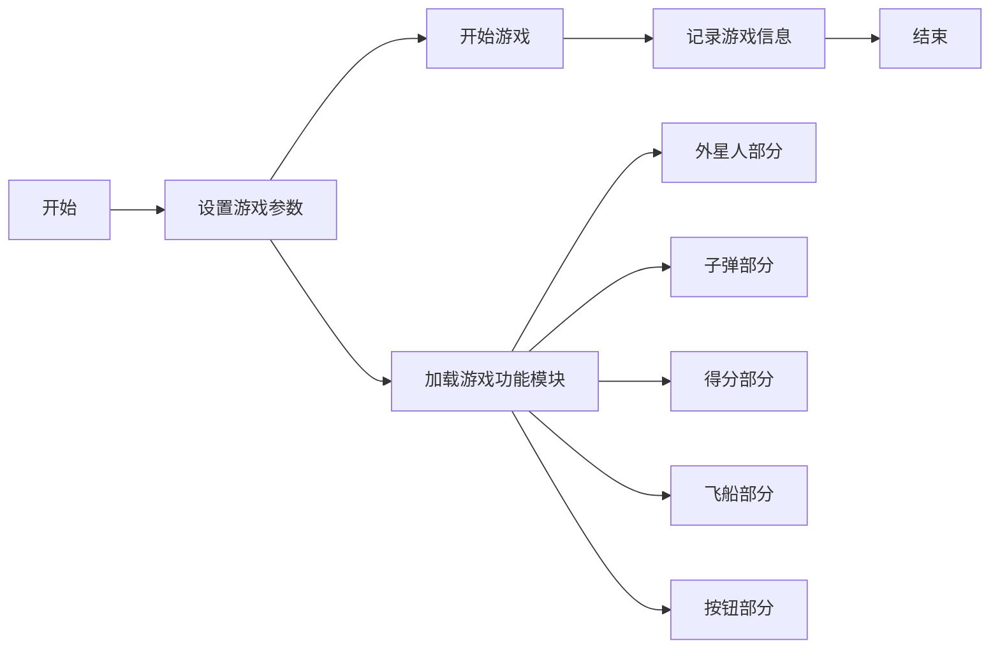
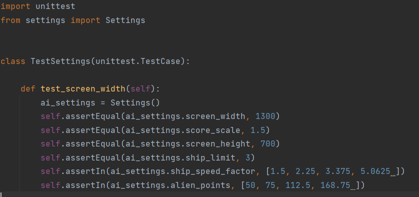
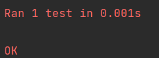
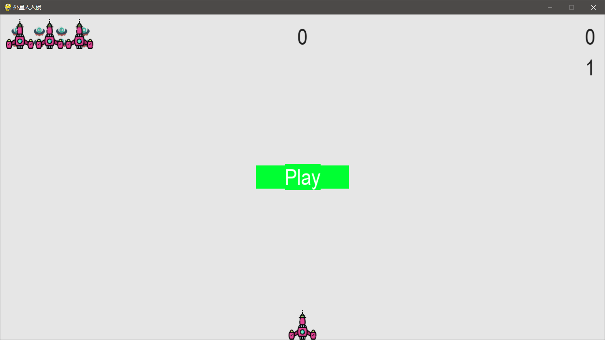
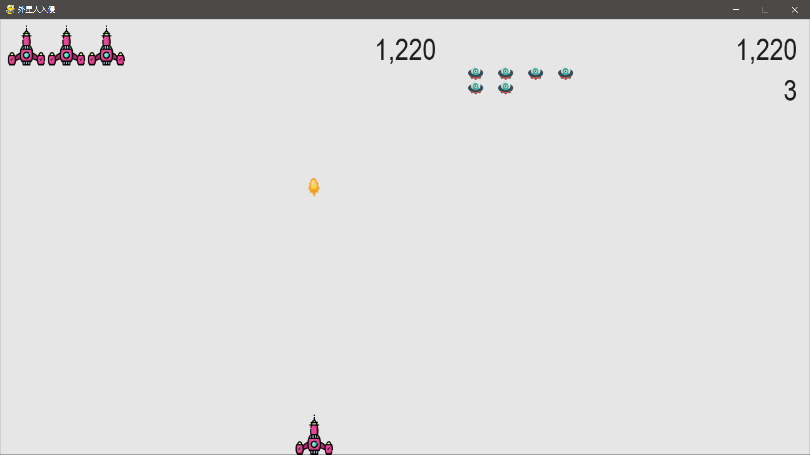

# 《Python程序设计基础》程序设计作品说明书

题目： 外星人入侵游戏

学院： 21计科01

姓名： 李佳琪

学号： B20210302131

指导教师： 周景

起止日期：2023.11.10-2023.12.10

## 摘要

本次设计完成的项目为外星人入侵游戏，使用了Pygame库来处理图形和动画,游戏的主流程界面包括创建相关类和参数，以及推动游戏进行。设计了外星人，得分，子弹，飞船等多个类 。在开发这个游戏的过程中，还将学习如何管理由多个文件组成的项目，构建大量代码并管理文件内容，以保持项目的组织和高效。游戏的目标是防御外星人的入侵,该项目的版本管理用 Git 实现，并编写了部分方法的单元测试。

关键词：python，面向对象编程，pygame,外星人入侵游戏

## 第1章 需求分析

1.实现教材12章的功能：创建游戏窗口、添加飞船图像、驾驶飞船、飞船可以射击子弹。

2.实现教材13章的功能：创建一群外星人、外星人可以移动、可以射杀外星人、结束游戏。

3.实现教材14章的功能：添加Play按钮、可以提高等级、计分功能。（20分）

4.实现教材部分练习的功能：练习12-6将飞船放在屏幕左侧进行射击、练习13-2在游戏背景中随机位置绘制星星、练习14-5 将游戏中得到的最高分保存到文件中

## 第2章 分析与设计

本次设计完成的项目为外星人入侵游戏，主要利用 pygame 和面向对象编程思想实现。本章将基于游戏规则一步步利用 pygame 设计实现该游戏。
首先介绍游戏规则：
游戏者将操纵一架战机与外星人群对抗，每击败一个外星人后会获得一定的分数，当将一个外星人群击败后会产生一个新的外星人群，并提高外星人群的移动速度。若最终有外星人靠近了战机，则本轮游戏失败，战机数量减一，当战机数量耗尽时，游戏结束。

系统流程：

## 第3章 软件测试

## 结论

通过开发Python外星人入侵游戏,该项目实现了外星人入侵游戏，学习如何使用Python语言和Pygame库来创建一个完整的游戏项目锻炼自己的编程技能，并学习游戏开发的基础知识和技巧。基本实现了需求内容。在游戏开发过程中，需要注意一些关键点，例如游戏窗口的创建和管理、游戏元素的绘制和处理、用户输入的处理、游戏逻辑的实现等。同时，还需要考虑游戏的可玩性和趣味性，以及如何设计和实现游戏的各种功能和元素。但最终呈现效果仍有些许不足，项目具有较大改进空间。比如游戏只有Play一个按钮，游戏内没有暂停等功能的按钮，外星人的进攻方式比较单一等缺点，这些都需要改进。

## 参考文献

[1] 埃里克·马瑟斯，Python 编程：从入门到实践（第 2 版），人民邮电出版社，2020.10.
